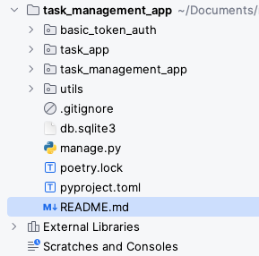
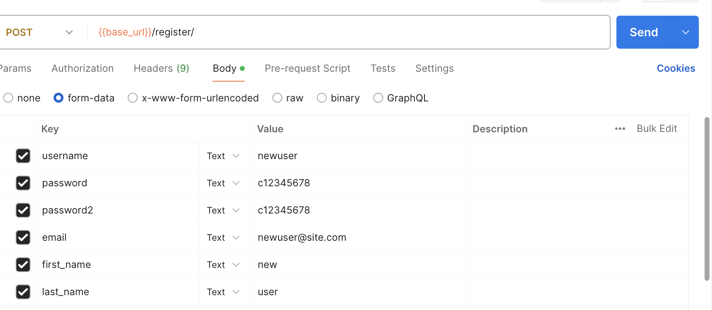
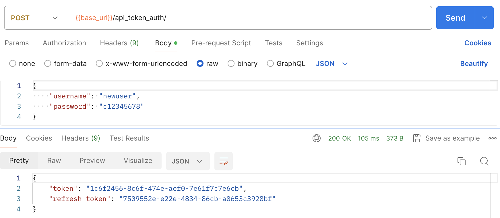
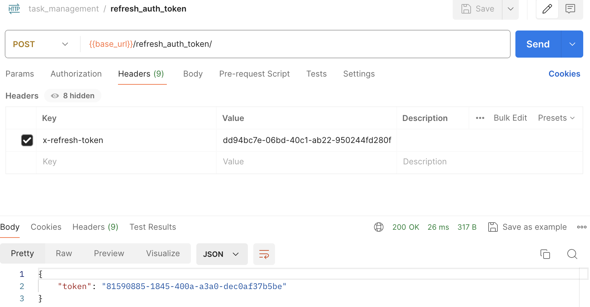
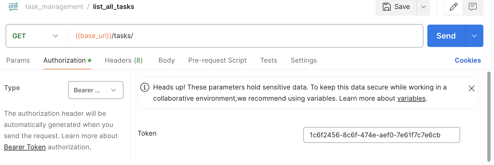
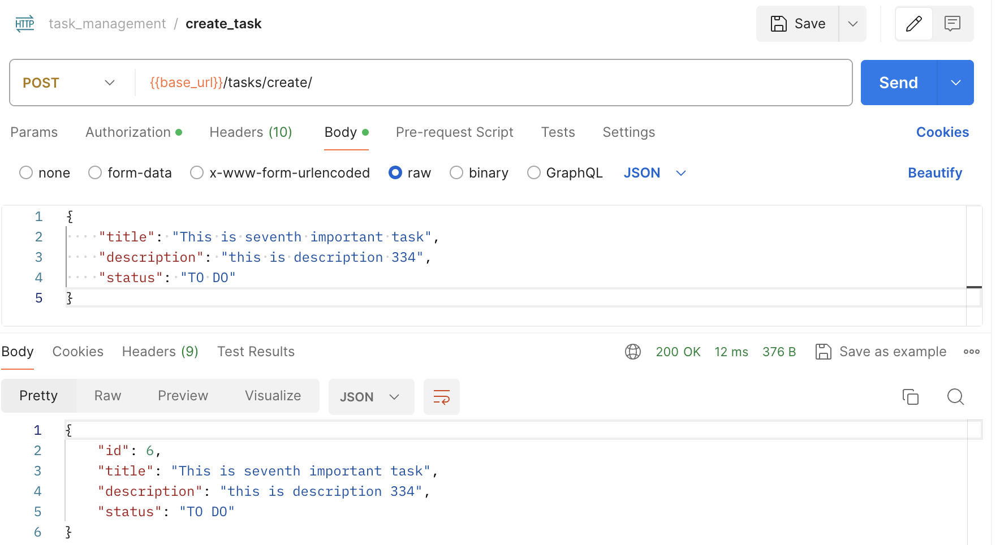
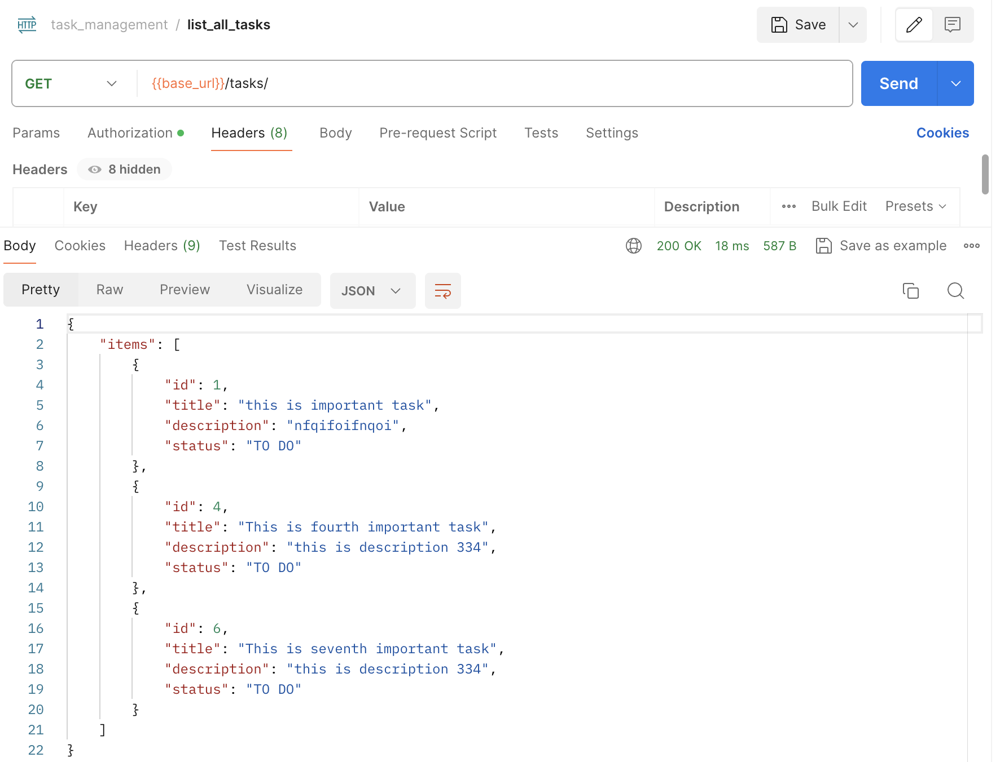
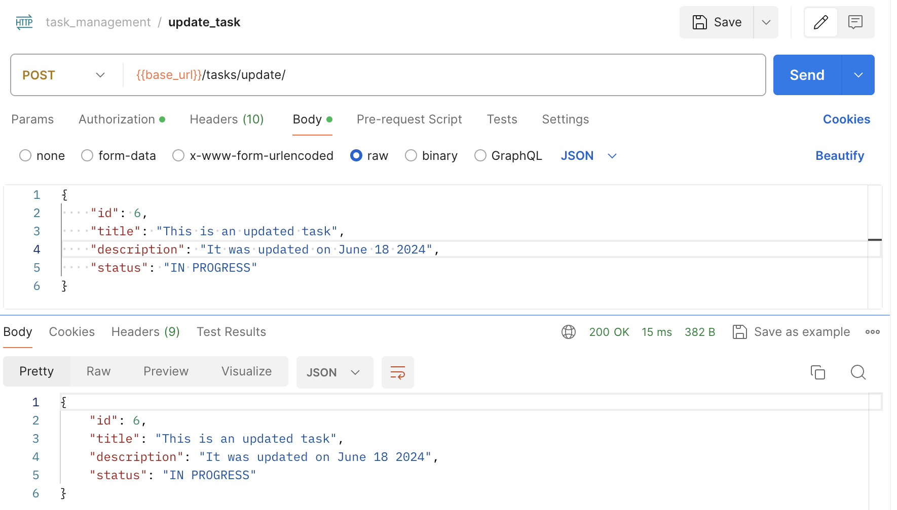
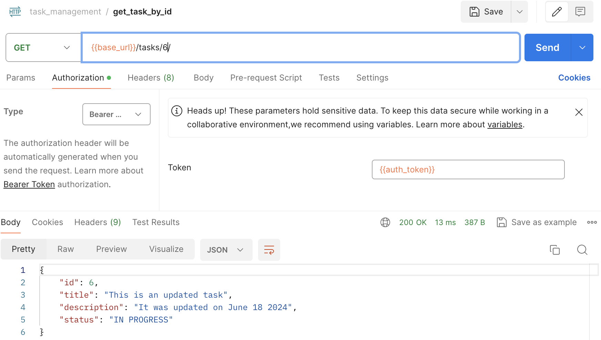

# Task Management App (Backend)

## Project Setup

This is  task management app based on django framework. For sake of simplicity I have used Sqlite 
database.
This app can be run on you local machine with little to minimal efforts.

For running it on local you will need
* python3.8
* pip environment or poetry

There are two ways to setup this project on you local machine.

1. If you have poetry install on you machine then run below command to set things up. You can get 
    poetry by following this guide [Poetry Guide](https://python-poetry.org/).

    `poetry install`

    After virtual environment is created by poetry. Run following command to run the application.

    `poetry run python manage.py runserver`

2. If you dont have poetry on you machine you can use good old pip. Create a virtual envrironment. 
   Activate you virtual environment and run.

    `pip install -r requirements.txt`

    After all the requirements are installed run the app using command.

    `python run manage.py runserver`

## Project Layout And Architecture

### Layout

Inside the root directory of the project you will see this directory structure. I have created two 
apps.

### **`basic_token_auth`** 

`basic_token_auth` is where all the logic for register, login and tokens resides. We will get in 
more details later.

### **`task_app`**

`task_app` is where all the logic for our app backend resides. Inside `task_app` we have a subapp 
`task`, it contains all the logic/apis related to the tasks that users will be using.

### **`task_management_app`**

This directory is created by django where all the stuff related to django settings and configurations 
is stored.

### **`utils`**

Here some files and modules are there which are needed for project.

Rest of the files are either related to poetry or django.

### Architecture

This backend app design follows **Clean Architecture**. It's a design philosphy which refers to 
code organization in seperate modules and components. Task Management App is divided into three layers
1. Data layer
2. Domain layer
3. Presentation layer

#### Data Layer

Data layer (Repo) is the component which deals directly with database. Its sole purpose is to fetch data 
from db.
  

#### Domain Layer
Domain layer(Usecases) is the part where all the business logic resides or usecases as we like to call it. 
Domain layer depends on data layer for getting data and then doing business logic on it.
  

#### Presentation Layer
Presentation layer is where our django views live. Presentation layer deals with designing the 
input from user or api payload. This layer depends on domain layer. This layer also handles the 
response format of the api.

## Register with the Task Management App

After the django server is successfully up and running. First thing we need to do is register a user.
For registering a new user make a call to end point `http://localhost:8000/register/` with the user 
details in form data. (Note: This is the only api where form data has been used). 
Rest all apis accept json payload. Refer the screenshot below for more details.

## Get Auth Token (Login) 

After you have successfully registered. You need to authenticate yourselves with the app and get auth 
token and refresh token. Auth token is set to expired in 1 day or 24 hours. After you auth token has expired 
you can get new token using refresh token api (will discuss this api after this).
To get the tokens make a call to `http://localhost:8000/api_auth_token/` with username and password.

Refer screenshot below to understand how to make a call to login api.

Now you have got auth token and refresh token. You are ready to use the task management app. But first lets 
see how to get new auth token before it expires.

## Refresh Auth Token

Auth token you recieved in previous api will expire in 24 hrs. After that you need to get new token. 
To get new auth token you need to provide your refresh token.
To get new auth token using refresh token make a call to `http://localhost:8000/refresh_auth_token/` 
and dont forget to set the refresh token in headers.
**(Here token values will not match because I took screenshot at different points in time.)**

Refer screenshot below for better understanding.

## Setting auth token in subsequent api calls

Now for making authenticated call to create, update and delete tasks, you need to set auth token in 
authorization headers.You need to do this for every api call.

Refer screenshot below for better understading.

## Creating your first task
After setting your auth token you can create you first task. To create a task make a call to 
`http://localhost:8000/create_task/`, with you task detail like title, description and status 
in request payload.
 Here remember one thing that in status, if you pass any other value than **`TO DO`, 
`IN PROGRESS` and `DONE`**, app will not accept it and will throw and error.

Refer screenshot for better understanding.

you will get back response with details of the task. This response will also contain `task_id` 
which will be used for updating and deleting tasks.

## List all tasks
To see all you tasks. Make a call to `http://localhost:8000/tasks/`.

## Update a task
To update an existing task, make a call to `http://localhost:8000/tasks/update/`. You can update `title`, 
`description` and `status`.

## Get task by id
You can get details of an individual task by making a call to `http://localhost:8000/tasks/<task_id>/` 
Lets see if the task we updated in last api was updated or not.

