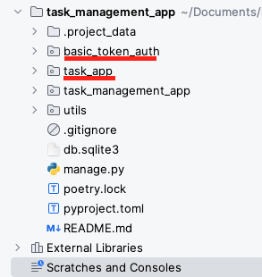

# Task Management App (Backend)

## Project Setup

This is  task management app based on django framework. For sake of simplicity I have used Sqlite 
database.
This app can be run on you local machine with little to minimal efforts.

For running it on local you will need
* python3.8
* pip environment or poetry

There are two ways to setup this project on you local machine.

1. If you have poetry install on you machine then run below command to setup things. You can get 
    poetry by following this guide [Poetry Guide](https://python-poetry.org/).

    `poetry install`

    After virtual environment is created by poetry. Run following command to run the application.

    `poetry run python manage.py runserver`

2. If you dont have poetry on you machine you can use good old pip. Create a virtual envrironment. 
   Activate you virtual environment and run.

    `pip install -r requirements.txt`

    After all the requirements are installed run the app using command.

    `python run manage.py runserver`

## Project Layout And Architecture

### Layout

Inside the root directory of the project you will see this directory structure. I have created two 
apps.

### **`basic_token_auth`** 

`basic_token_auth` is where all the logic for register, login and tokens resides. We will get in 
more details later.

### **`task_app`**

`task_app` is where all the logic for our app backend resides. Inside `task_app` we have a subapp 
`task`, it contains all the logic/apis related to the tasks that users will be using.

### **`task_management_app`**

This directory is created by django where all the stuff related to django settings and configurations 
is stored.

### **`utils`**

Here some files and modules are there which are needed for project.

Rest of the files are either related to poetry or django.

### Architecture

This backend app design follows **Clean Architecture**. It's a design philosphy which refers to 
code organization in seperate modules and components. Task Management App is divided into three layers
1. Data layer
2. Domain layer
3. Presentation layer

#### Data Layer

Data layer (Repo) is the component which deals directly with database. Its sole purpose is to fetch data 
from db.
  

#### Domain Layer
Domain layer(Usecases) is the part where all the business logic resides or usecases as we like to call it. 
Domain layer depends on data layer for getting data and then doing business logic on it.
  

#### Presentation Layer
Presentation layer is where our django views live. Presentation layer deals with designing the 
input from user or api payload. This layer depends on domain layer. This layer also handles the 
response format of the api.

